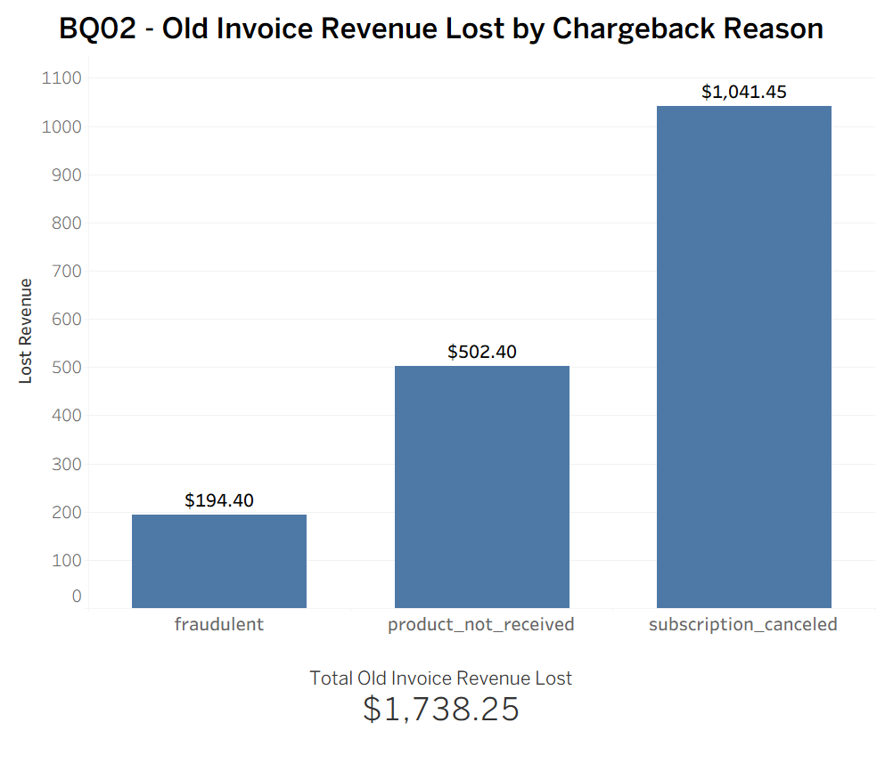
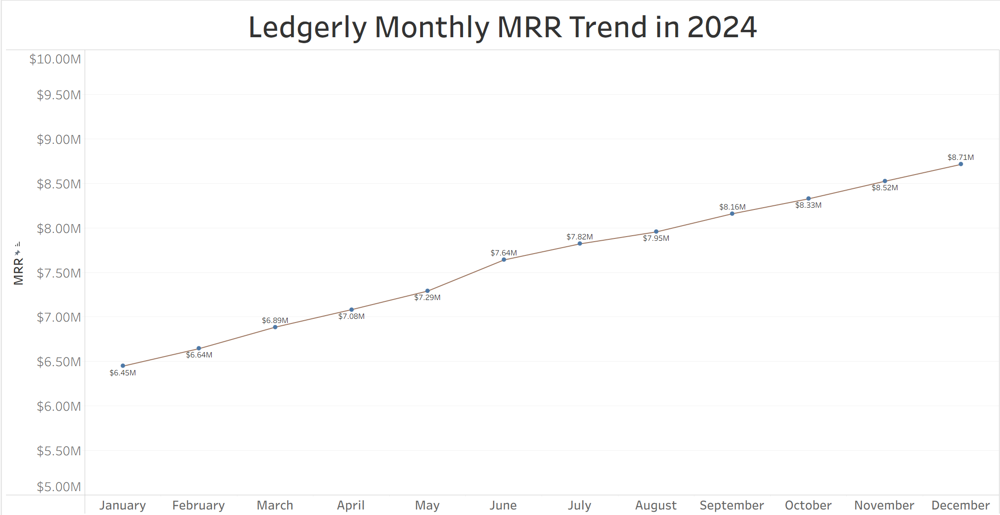
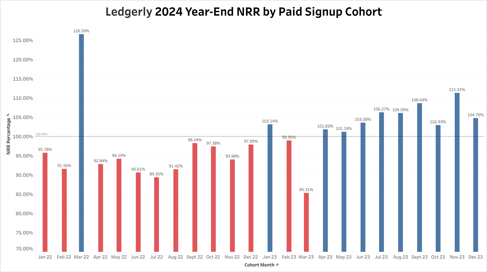
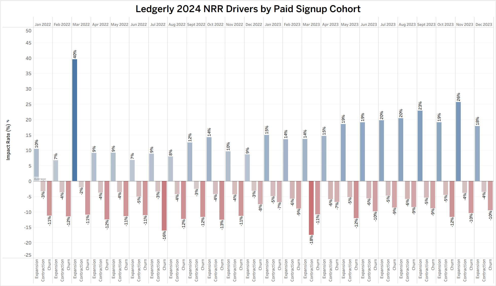

WIP : July 5th 2026
# Ledgerly — SaaS Billing Reconciliation & Revenue Analytics

**Billing Reconciliation, MRR Movement, Net Revenue Retention, Cohort Analysis, and Processor Settlement Analytics**

 
End-to-end SaaS billing analytics project analyzing synthetic Stripe-style billing data from a B2B subscription business. The analysis covers processor settlement reconciliation, chargeback restatements, MRR movement, and net revenue retention by paid signup cohort — built entirely in Snowflake using a **RAW** → **STAGING** → **ANALYTICS** architecture.

  

➤ Project Purpose : 

**Revenue analytics** breaks into tasks that look unrelated on the surface. Checking whether Stripe settled the right amount feels nothing like calculating NRR by cohort. Tracing a chargeback back to an old invoice feels nothing like decomposing MRR movement into new, expansion, contraction, and churn.

Ledgerly treats them as one connected problem. 

A B2B SaaS company billing through Stripe generates revenue across **nine data tables** :
- 25,000 **customers**,
- 26,250 **subscriptions**,
- 321,114 **invoices**,
- 359,466 **charges**,
- 4,158 **refunds**,
- 288 **disputes**,
- 324,306 **balance transactions** ,
- 156 **payouts**, and
- 36,418 **subscription events**

The data spans 2022 through 2024. 
Each of those tables answers a different slice of the same question: 
Did the business generate the revenue it was supposed to, collect it correctly, and keep it?

The seven business questions in this project work through that question from different angles. 

**BQ01** and **BQ02** sit at the **processor layer** — where the money physically moves and where gaps and chargebacks quietly restate numbers that already closed.   
**BQ03** and **BQ04** sit at the **MRR layer** — what the recurring revenue line looks like month to month and what caused each movement.   
**BQ05** and **BQ06** sit at the **cohort layer** — which groups of customers held their MRR through 2024 and which lost it, and exactly how much of that outcome came from expansion, contraction, or churn.  

The project is built in Snowflake. Nine staging tables, three schema layers, one analytics table per business question. Every table states its grain. Every filter has a reason.

  

➤ **Skills Demonstrated:**

(SQL • Snowflake • Billing Reconciliation • MRR Movement Analytics • Net Revenue Retention • Cohort Analysis • Window Functions • Data Quality Validation)
  

## Core Business Questions :

**BILLING RECONCILIATION**  
**BQ01** — Which June Stripe invoices have reconciliation gaps, and why? 
**BQ02** — How much old invoice revenue did we lose to June chargebacks, and why?
 

**REVENUE ANALYTICS**  
**BQ03** — What was month-by-month MRR movement in 2024? 
**BQ04** — What drove the 2024 MRR movement?
 

**COHORT & RETENTION ANALYTICS**  
**BQ05** — Which first-paid customer cohorts had the strongest and weakest NRR from December 2023 starting MRR to December 2024 ending MRR? 
**BQ06** — How did expansion, contraction, and churn affect 2024 year-end NRR by paid signup cohort?
 

---

 

## The Main Report - Key Questions Answered

 

### BQ01 - Which June Stripe invoices have reconciliation gaps, and why

The main output is not a dashboard metric. It is an invoice-level exception report.  
**Note** : the WHY can be seen from the column named **"GAP_REASON"**.

  <b>
    <a href="Data_Generated/BQ01C_INVOICE_PROCESSOR_RECON_2024.csv">
      Download CSV: BQ01C Invoice Reconciliation Exception Report
    </a>
  </b>

Finance would use the 250-row output to review each invoice with a reconciliation gap and trace whether the gap came from refund activity, dispute activity, or another processor-side mismatch.

 

**Key Insights**

- BQ01 produced an invoice-level exception report identifying 250 June Stripe invoices where the billing-side paid amount did not match the Stripe-side processed amount.
- The output is designed for finance review at the invoice level, with each row showing the invoice ID, customer ID, billing amount, Stripe processed amount, reconciliation gap, and reason classification.
- Summary: 250 invoices required review. Most were partial refunds; disputes were fewer but larger per invoice.

  

### BQ02 - How much old invoice revenue did we lose to June chargebacks, and why?**

 

**Chart**

  

 

**Key Insights**
- June chargebacks caused $1,738.25 in old invoice revenue loss.
- Only 8 old invoices were affected. So this is a small-volume issue, not a large operational failure.
- **subscription_canceled** was the biggest loss reason. It affected 4 invoices and caused $1,041.45 in lost revenue. It made up about 60% of total lost revenue.
- **product_not_received** was the second-largest reason. It affected 3 invoices and caused $502.40 in lost revenue.
- Fraud was not the main problem. **fraudulent** affected only 1 invoice and caused $194.40 in lost revenue.

  

---

### BQ03 - What was month-by-month MRR movement in 2024

 

**Chart**

  

 

**Key Insights**
- Ledgerly’s MRR increased every month in 2024. MRR rose from $6.45M in January to $8.71M in December, with no month-over-month decline.
- Total January-to-December MRR growth was about $2.27M. That equals about 35.1% growth from January’s MRR base.
- June was the strongest growth month. MRR increased by about $349K from May to June, the largest monthly gain in the year.
- Growth stayed positive after June, but the pace became more moderate.
- The business kept adding MRR through December, but the monthly increases after June were smaller than the June spike.

  

### BQ04 - What drove the 2024 MRR movement?

 

**Chart**

  

 

**Key Insights**
- **New MRR** was the most consistently strong positive driver. It stays high across the year and is usually above the other positive driver lines.
- **Expansion MRR** had a clear spike around June. This is the most visible expansion peak on the chart.
- **Reactivation MRR** was a minor driver. It stays much lower than new MRR and expansion MRR, and appears near zero in several months.
- **Churn** was the main negative pressure. The churn line is generally the deepest negative line on the chart. August was the clearest churn problem month. Churn drops to its lowest point around August.
- **Contraction** was negative but generally smaller than churn. It stayed below zero, but usually closer to zero than churn.

 

#### Business Implications for BQ03 + BQ04

Ledgerly should use the monthly MRR trend to identify when revenue momentum strengthened or weakened, then use the MRR driver breakdown to decide which lever to act on. The company should protect the strongest positive drivers, especially New MRR and Expansion MRR, while prioritizing churn reduction because churn was the largest negative pressure on recurring revenue.

Actions:

- **Use monthly MRR movement as the monitoring signal.** When a month shows stronger or weaker MRR movement, flag it for follow-up instead of treating the annual growth trend as enough.
- **Use the driver breakdown to choose the response.** If growth slowed because New MRR weakened, review acquisition. If Expansion MRR weakened, review upgrade motion. If churn increased, review retention.
- **Study the June expansion spike.** Identify which plans, customer types, or upgrade actions caused Expansion MRR to peak, then decide whether that expansion pattern can be repeated.
- **Study August churn.** August showed the clearest churn problem, so Ledgerly should break it down by plan, cohort, subscription age, and customer segment.

  

---

### BQ05 — Which first-paid customer cohorts had the strongest and weakest 2024 net revenue retention?

 

Cohorts are defined by each customer's first paid invoice month, covering January 2022 through December 2023.
2024 year-end NRR is calculated as: December 2024 MRR / December 2023 MRR
The denominator is December 2023 MRR — not a strict active membership filter. 
Any customer with MRR > 0 in December 2023 is included in the base, even if their subscription ended during that month.

 

**Chart**

  

 

**Key Insights**
- **Overall 2024 year-end NRR was slightly below full retention.** Across all customer cohorts, ending MRR was lower than starting MRR: 99.4% overall NRR.
- **The strongest cohort was March 2022.** The Mar 2022 cohort had the highest NRR at 126.59%, meaning its ending MRR was about 26.6% higher than its starting MRR.
- **The weakest cohort was March 2023.** The Mar 2023 cohort had the lowest NRR at 85.31%, meaning it retained only about 85% of its starting recurring revenue by year-end.
- **More cohorts shrank than grew.** Out of 24 customer cohorts, 13 cohorts ended below 100% NRR, while 11 cohorts ended at or above 100%.
- **2023 cohorts performed better overall than 2022 cohorts.** The average 2023 cohort NRR was about 102.8%, while the average 2022 cohort NRR was about 96.7%. This suggests newer customer cohorts held or expanded revenue better than older cohorts.
- **The 100% line separates expansion from contraction.** Blue cohorts added or retained more recurring revenue than they started with. Red cohorts lost recurring revenue by year-end.

  

### BQ06 - How did expansion, contraction, and churn affect 2024 year-end NRR by paid signup cohort?

 

**Chart**

  

 

**Key Insights**
- **Expansion was positive in every cohort.** Every paid signup cohort added expansion MRR, showing that retained customers generally grew over time.
- **2023 cohorts had stronger expansion than most 2022 cohorts.** From Jan 2023 onward, expansion was mostly in the mid-teens to mid-20s, while many 2022 cohorts stayed below 10%.
- **Mar 2022 was the strongest outlier.** The Mar 2022 cohort had about +40% expansion, far higher than the other cohorts.
- **Mar 2023 was the weakest cohort.** It had the heaviest combined revenue drag, especially from contraction, which pulled its NRR below the other cohorts.
- **Churn was usually the larger negative driver.** Across most cohorts, churn took more starting MRR away than contraction.
 

#### Business Implications for BQ05 + BQ06

- **Launch churn-prevention plays for high-churn cohorts.** Churn removed more starting MRR than contraction in most cohorts, so Ledgerly should focus on preventing customers from going to zero through renewal outreach, payment recovery, cancellation-save offers, and usage-based intervention.
- **Create downgrade-prevention offers for high-contraction cohorts.** Contraction is a different problem from churn. For cohorts with heavy contraction, Ledgerly should offer better downgrade paths, right-sized plans, pricing adjustments, or temporary retention offers before customers cut MRR sharply.
- **Turn high-expansion cohorts into an upsell playbook.** Some cohorts expanded far more than others. Ledgerly should identify the repeatable upgrade motion behind those cohorts and use it to target cohorts with weaker expansion.
- **Manage retention by cohort driver, not by average NRR.** A 99.4% overall NRR hides different problems across cohorts. Cohorts below 100% need targeted action based on the main driver: churn recovery, downgrade prevention, or expansion campaigns.

