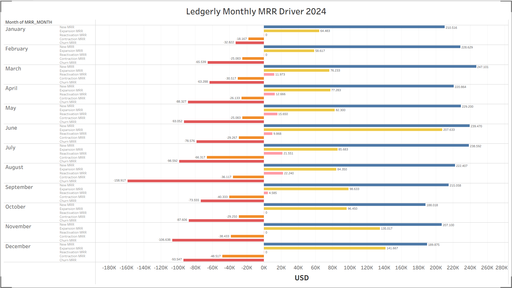

WIP : July 3rd 2026
# Ledgerly — SaaS Billing Reconciliation & Revenue Analytics

**Billing Reconciliation, MRR Movement, Net Revenue Retention, Cohort Analysis, and Processor Settlement Analytics**

 
End-to-end SaaS billing analytics project analyzing synthetic Stripe-style billing data from a B2B subscription business. The analysis covers processor settlement reconciliation, chargeback restatements, MRR movement, and net revenue retention by paid signup cohort — built entirely in Snowflake using a **RAW** → **STAGING** → **ANALYTICS** architecture.

  

➤ Project Purpose : 

**Revenue analytics** breaks into tasks that look unrelated on the surface. Checking whether Stripe settled the right amount feels nothing like calculating NRR by cohort. Tracing a chargeback back to an old invoice feels nothing like decomposing MRR movement into new, expansion, contraction, and churn.

Ledgerly treats them as one connected problem. 

A B2B SaaS company billing through Stripe generates revenue across **nine data tables** :
- 25,000 **customers**,
- 26,250 **subscriptions**,
- 321,114 **invoices**,
- 359,466 **charges**,
- 4,158 **refunds**,
- 288 **disputes**,
- 324,306 **balance transactions** ,
- 156 **payouts**, and
- 36,418 **subscription events**

The data spans 2022 through 2024. 
Each of those tables answers a different slice of the same question: 
Did the business generate the revenue it was supposed to, collect it correctly, and keep it?

The seven business questions in this project work through that question from different angles. 

**BQ01** and **BQ02** sit at the **processor layer** — where the money physically moves and where gaps and chargebacks quietly restate numbers that already closed.   
**BQ03** and **BQ04** sit at the **MRR layer** — what the recurring revenue line looks like month to month and what caused each movement.   
**BQ05** isolates the invoices that failed every payment retry and were marked uncollectible — revenue that left the business permanently, not temporarily.   
**BQ06** and **BQ07** sit at the **cohort layer** — which groups of customers held their MRR through 2024 and which lost it, and exactly how much of that outcome came from expansion, contraction, or churn.  

The project is built in Snowflake. Nine staging tables, three schema layers, one analytics table per business question. Every table states its grain. Every filter has a reason.

  

➤ **Skills Demonstrated:**

(SQL • Snowflake • Billing Reconciliation • MRR Movement Analytics • Net Revenue Retention • Cohort Analysis • Window Functions • Data Quality Validation)
  

## Core Business Questions :

**BILLING RECONCILIATION**  
**BQ01** — Which June Stripe invoices have reconciliation gaps, and why? 
**BQ02** — How much old invoice revenue did we lose to June chargebacks, and why?
 

**REVENUE ANALYTICS**  
**BQ03** — What was month-by-month MRR movement in 2024? 
**BQ04** — What drove the 2024 MRR movement? 
**BQ05** — How much recurring revenue was permanently lost each month in 2024 after all payment retries were exhausted?
 

**COHORT & RETENTION ANALYTICS**  
**BQ06** — Which paid signup cohorts had the strongest and weakest 2024 year-end NRR? 
**BQ07** — How did expansion, contraction, and churn affect 2024 year-end NRR by paid signup cohort?
 

---

 

## The Main Report - Key Questions Answered

 

### BQ01 - Which June Stripe invoices have reconciliation gaps, and why

The main output is not a dashboard metric. It is an invoice-level exception report.

  <b>
    <a href="Data_Generated/BQ01C_INVOICE_PROCESSOR_RECON_2024.csv">
      Download CSV: BQ01C Invoice Reconciliation Exception Report
    </a>
  </b>

Finance would use the 250-row output to review each invoice with a reconciliation gap and trace whether the gap came from refund activity, dispute activity, or another processor-side mismatch.

 

**Key Insights**

- BQ01 produced an invoice-level exception report identifying 250 June Stripe invoices where the billing-side paid amount did not match the Stripe-side processed amount.
- The output is designed for finance review at the invoice level, with each row showing the invoice ID, customer ID, billing amount, Stripe processed amount, reconciliation gap, and reason classification.
- Summary: 250 invoices required review. Most were partial refunds; disputes were fewer but larger per invoice.

  

### BQ02 - How much old invoice revenue did we lose to June chargebacks, and why?**

 

**Charts**

  

 

**Key Insights**
- June chargebacks caused $1,738.25 in old invoice revenue loss.
- Only 8 old invoices were affected. So this is a small-volume issue, not a large operational failure.
- **subscription_canceled** was the biggest loss reason. It affected 4 invoices and caused $1,041.45 in lost revenue. It made up about 60% of total lost revenue.
- **product_not_received** was the second-largest reason. It affected 3 invoices and caused $502.40 in lost revenue.
- Fraud was not the main problem. **fraudulent** affected only 1 invoice and caused $194.40 in lost revenue.

  

### BQ03 - What was month-by-month MRR movement in 2024

 

**Charts**

  

 

**Key Insights**
- Ledgerly’s MRR increased every month in 2024. MRR rose from $6.45M in January to $8.71M in December, with no month-over-month decline.
- Total January-to-December MRR growth was about $2.27M. That equals about 35.1% growth from January’s MRR base.
- June was the strongest growth month. MRR increased by about $349K from May to June, the largest monthly gain in the year.
- Growth stayed positive after June, but the pace became more moderate.
- The business kept adding MRR through December, but the monthly increases after June were smaller than the June spike.

  

### BQ04 - What drove the 2024 MRR movement?

 

**Charts**

  

 

**Key Insights for Net MRR movement**
- **Net MRR movement** stayed positive every month. The net MRR line remains above zero from January through December.
- June appears to be the strongest net growth month. Net MRR reaches its highest point around June.
- August appears to be the weakest net growth month. Net MRR reaches its lowest point around August while churn is at its deepest.

**Key Insights for MRR movement drivers**
- **New MRR** was the most consistently strong positive driver. It stays high across the year and is usually above the other positive driver lines.
- **Expansion MRR** had a clear spike around June. This is the most visible expansion peak on the chart.
- **Reactivation MRR** was a minor driver. It stays much lower than new MRR and expansion MRR, and appears near zero in several months.
- **Churn** was the main negative pressure. The churn line is generally the deepest negative line on the chart. August was the clearest churn problem month. Churn drops to its lowest point around August.
- **Contraction** was negative but generally smaller than churn. It stayed below zero, but usually closer to zero than churn.
  

